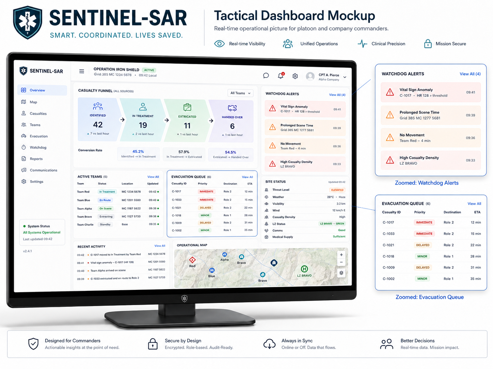

# C5 Sentinel-SAR

Development repository for an offline-first medical command-and-control prototype for search-and-rescue mass-casualty operations.

[Live demo](https://raanank10.github.io/Medical-C5-System-For-SAR/) | [Development guide](docs/DEVELOPMENT.md) | [Architecture](docs/ARCHITECTURE.md) | [Tactical UI](docs/TACTICAL_UI_GUIDELINES.md) | [Field gaps](docs/FIELD_EXPERIMENT_GAPS.md) | [Production readiness](docs/PRODUCTION_READINESS.md)



## Purpose

This repository is the active development home for C5 Sentinel-SAR. The goal is to turn a field-tested product idea into a maintainable prototype that can evolve toward:

- a local-first medic workflow
- a platoon/company command dashboard
- an event-sourced sync model
- analytics and after-action review reporting
- eventually, separate production-grade mobile, web, API, and database layers

The current implementation is intentionally lightweight: a standalone HTML prototype, SQL schema drafts, and a Python analytics package. That keeps iteration fast while the product, data model, and operational workflow are still being validated.

## Current State

| Area | Status | Notes |
| --- | --- | --- |
| Field/command prototype | Active v2.0 demo | `index.html` and `demo/rescue-app.html` |
| Product specification | Active v2.0 role-command addendum | `docs/ROLE_COMMAND_MODEL_v2.0.md`, `docs/ALERT_OWNERSHIP_v1.3.md`, `docs/C5_SENTINEL_SAR_MVP_SPEC_v1.2.md` |
| API contract | Draft v1.2 | `docs/API_SURFACE_v1.2.md` |
| Data model | Draft PostgreSQL schema | `database/001_postgresql_schema_v1.2.sql` |
| Demo data | Draft seed data | `database/002_seed_demo_data_v1.2.sql` |
| Analytics/AAR | Working local package | `analytics/c5_sentinel_sar_analytics_v1_1/` |
| Production backend | Not implemented | Planned after the workflow stabilizes |
| Native mobile app | Not implemented | Planned after local storage and sync are validated |

## Quick Start

Clone the repo:

```bash
git clone https://github.com/Raanank10/Medical-C5-System-For-SAR.git
cd Medical-C5-System-For-SAR
```

Open the standalone prototype:

```bash
start index.html
```

Run the repository health check:

```bash
python scripts/check_repo.py
```

Run the domain-rule regression tests:

```bash
node tests/domain-rules.test.js
```

Run the analytics demo:

```bash
cd analytics/c5_sentinel_sar_analytics_v1_1
python -m venv .venv
.venv\Scripts\activate
pip install -r requirements.txt
python seed_demo_db.py
python -c "from db import DB; from kpis import KPIEngine; from report import ReportGenerator; db=DB('rescue_demo_v1_1.db'); kpi=KPIEngine(db); ReportGenerator(kpi).save('aar_report_v1_1.html')"
```

## Repository Map

```text
.
|-- index.html                         # standalone prototype entry point
|-- demo/
|   `-- rescue-app.html                # explicit demo artifact
|-- docs/
|   |-- ARCHITECTURE.md                # system design and module boundaries
|   |-- DEVELOPMENT.md                 # local setup and contribution workflow
|   |-- TACTICAL_UI_GUIDELINES.md      # field UI principles and New Patient guardrails
|   |-- PRODUCTION_READINESS.md        # path from prototype to pilot/production readiness
|   |-- OPERATIONS_SAFETY.md           # safety/privacy boundaries
|   |-- ROLE_AUTHORIZATION_AND_WATCHDOGS_v1.2.md
|   |-- ALERT_OWNERSHIP_v1.3.md
|   |-- ROLE_COMMAND_MODEL_v2.0.md
|   |-- C5_SENTINEL_SAR_MVP_SPEC_v1.2.md
|   |-- API_SURFACE_v1.2.md
|   |-- METRICS_DICTIONARY.md
|   |-- PC_DEMO_SCRIPT.md
|   `-- ROADMAP.md
|-- database/
|   |-- 001_postgresql_schema_v1.2.sql
|   |-- 002_seed_demo_data_v1.2.sql
|   `-- 003_mci_ui_alignment.sql
|-- src/
|   `-- domain/rules.js               # testable triage, vitals, alert, and timing rules
|-- tests/
|   `-- domain-rules.test.js
|-- analytics/
|   `-- c5_sentinel_sar_analytics_v1_1/
|-- assets/
|   `-- mockups/
|-- scripts/
|   `-- check_repo.py
`-- archive/
    |-- v0.6/
    `-- v0.7/
```

## Development Direction

The repo should move from prototype assets toward a clean product-development structure:

1. Keep `index.html` stable as the fastest field demo.
2. Extract shared product rules from the prototype into documented state machines and fixtures.
3. Add tests around triage, vitals intervals, inventory burn, sync ingestion, and AAR metrics.
4. Split the next implementation into app boundaries only when the workflow stops changing quickly.
5. Treat all patient data as synthetic until a formal privacy and governance review exists.

See [docs/ROADMAP.md](docs/ROADMAP.md) for the active build plan.

## Core Concepts

| Concept | Meaning in this repo |
| --- | --- |
| Offline-first | Field users must keep working without reliable connectivity. |
| Event-sourced sync | Devices append operational events; command state is projected from the log. |
| Poison event quarantine | Invalid sync events are preserved for review instead of blocking the whole batch. |
| Command snapshot | Dashboards should read precomputed state, not reconstruct every view from raw history. |
| AAR analytics | The event log becomes incident learning: timelines, metrics, bottlenecks, and gaps. |

## Useful Links

- [Development guide](docs/DEVELOPMENT.md)
- [Architecture](docs/ARCHITECTURE.md)
- [Tactical UI guidelines](docs/TACTICAL_UI_GUIDELINES.md)
- [Production readiness path](docs/PRODUCTION_READINESS.md)
- [Field experiment gap register](docs/FIELD_EXPERIMENT_GAPS.md)
- [Operations and safety notes](docs/OPERATIONS_SAFETY.md)
- [Role authorization and watchdog stack](docs/ROLE_AUTHORIZATION_AND_WATCHDOGS_v1.2.md)
- [Alert ownership and reinforcement workflow v1.3](docs/ALERT_OWNERSHIP_v1.3.md)
- [Role-based medical command model v2.0](docs/ROLE_COMMAND_MODEL_v2.0.md)
- [Metrics dictionary](docs/METRICS_DICTIONARY.md)
- [Demo script](docs/PC_DEMO_SCRIPT.md)
- [v2.0 changelog](docs/CHANGELOG_v2.0.md)
- [v1.3 changelog](docs/CHANGELOG_v1.3.md)
- [v1.2 changelog](docs/CHANGELOG_v1.2.md)

## Safety Status

C5 Sentinel-SAR is a prototype. It is not a certified medical device, is not operationally deployed, and must not be used with real patient-identifiable data without organizational authorization, privacy controls, security review, and clinical governance.

## Maintainer

Raanan Kelner
