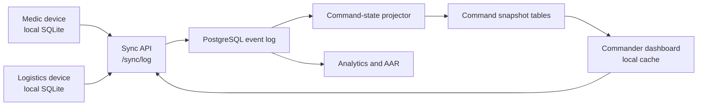

# Architecture

C5 Sentinel-SAR is designed as a local-first command-and-control system for medical SAR workflows. The repo currently contains a prototype and design assets, but the intended architecture is explicit so future implementation work has a stable direction.

## System Shape



## Runtime Boundaries

| Boundary | Responsibility | Current repo artifact |
| --- | --- | --- |
| Field app | Capture patients, vitals, treatments, handovers, and local alerts | `index.html` |
| Command dashboard | Show incident state, stale data, high-risk alerts, and site progress | `index.html`, `assets/mockups/` |
| Domain rules | Triage, vitals timers, tourniquet timers, and alert classification | `src/domain/rules.js` |
| Sync API | Accept and return ordered event batches | `docs/API_SURFACE_v1.2.md` |
| Event store | Preserve clinical and operational history | `database/001_postgresql_schema_v1.2.sql` |
| Projectors | Convert raw events into command-ready state | SQL views and future workers |
| Analytics | Compute KPIs and generate AAR material | `analytics/c5_sentinel_sar_analytics_v1_1/` |

## Event Model

The intended source of truth is an append-only event log.

- Devices create local events first.
- Events receive local IDs and timestamps before sync.
- The server accepts valid events in a batch even if other events fail.
- Invalid or dependency-blocked events are written to an ingestion error table.
- Clinical history is not silently rewritten.
- Command views read projected state.

## Handover and Command State

MIST handover is represented by `PATIENT_HANDED_OVER`. The event is local-first, idempotent by `device_id + local_event_id`, and may carry secure QR token metadata for cross-agency pickup. The projection sets the patient to `handed_over`, clears `needs_full_assessment`, and resolves patient-specific watchdog alerts such as vitals overdue or tourniquet reassessment overdue.

The Chamal/command dashboard should read `incident_command_state` through backend APIs. The database also exposes `vw_command_incident_throughput_funnel` for operational throughput and AAR analytics without forcing dashboard requests to scan the raw event log.

Black/expectant triage is represented by `PATIENT_TRIAGED_EXPECTANT`. It is a fast-exit event: the client bypasses remaining forms, and the projection sets `current_triage = black`, `current_status = deceased`, and `needs_full_assessment = false`.

## Domain Rules

The first extracted domain module is `src/domain/rules.js`. It is deliberately browser-compatible and CommonJS-compatible so the standalone prototype can load it directly while Node can test it without a build step. Because there is no build step, the browser doesn't load this file directly - `index.html` and `demo/rescue-app.html` each carry an inlined copy of the same `buildDomainRules()` factory body. `scripts/check_repo.py` enforces that the inlined copies stay byte-identical (modulo whitespace/formatting) to `src/domain/rules.js`, so a change made in only one place fails CI instead of silently diverging - this is how the SABCDE airway-check drift and the untested `suggestedSweepColor` sweep classifier both happened in the first place.

Covered today:

- vitals reassessment eligibility
- vitals warning/overdue timers
- tourniquet warning/critical timers
- MSTART fast-sweep classification (`suggestedSweepColor` - walking/breathing/perfusion/AVPU/trapped fields, used during the initial scan)
- MSTART full-vitals triage calculation and suggestion reasons (`computeMstartTriage` / `suggestMstartTriage`, used for re-triage once full vitals are recorded - a distinct function from the sweep classifier above, not a duplicate of it)
- deterioration detection
- routine vs. critical alert classification

When changing anything in this file, edit `src/domain/rules.js` first, then copy the exact same `buildDomainRules() { ... }` body into both `index.html` and `demo/rescue-app.html` - `python scripts/check_repo.py` will catch it if the copies drift.

For product-level UI guardrails, see `docs/TACTICAL_UI_GUIDELINES.md`. For the production hardening path, see `docs/PRODUCTION_READINESS.md`.

## Data Freshness

The product treats stale data as an operational condition, not a UI bug.

- Device presence is tracked through heartbeat events — implemented: `index.html` upserts its own `device_presence` row (RLS-scoped, `database/004_rls_gap_fixes_and_trigger_security_definer.sql`/`005_rls_performance_fixes.sql`) every 45s, and the command device panel reads real rows for the incident rather than inferring devices from patient data (`docs/ROADMAP.md` Phase 3).
- Command views must show last-seen and sync-latency indicators.
- Alerts should distinguish "patient deteriorating" from "data stale."
- The AAR should include sync gaps and stale periods.

## Backend Deployment Status

`database/001_postgresql_schema_v1.2.sql` was deployed for the first time this session, to a real Supabase project (`c5-sentinel-sar`, project ref `btvvjmuwdzirjyauyijx`) rather than staying an undeployed draft. Deploying it surfaced real gaps that weren't visible from reading the file - see `database/004_rls_gap_fixes_and_trigger_security_definer.sql` and `database/005_rls_performance_fixes.sql`, applied immediately after: 19 views were bypassing RLS entirely, 17 tables never had RLS enabled, and several trigger functions needed `SECURITY DEFINER` to keep cascading safety-alert writes (e.g. pediatric medication warnings) working once RLS is enforced against real non-service-role accounts. Supabase's security and performance advisors are both clean as of this deployment.

Real Supabase Auth is now wired: one test account per role (including `rpc`/`rcc`, added to the `user_role` enum in `database/006_add_rpc_rcc_enum_values.sql`) exists with a matching `profiles` row, and every RLS boundary described above has been exercised end to end with those accounts, not just asserted - including confirming that a medic's pediatric-medication event genuinely fails to alert without the `SECURITY DEFINER` fix, and that it genuinely works with it. `database/007_rpc_rcc_site_authority_rls.sql` gives `rpc`/`rcc` the site-authority actions from `docs/ROLE_COMMAND_MODEL_v2.8.md` (declare incident official + T0, open/close, building status, site clear, first-responder patient intake) without touching clinical write access.

`profiles.id` had no foreign key to `auth.users` and no trigger creating a `profiles` row on signup (`database/008_auto_create_profile_on_signup.sql` fixes this) - without it, `app.current_user_role()` returns `NULL` for any real signup, which fails every RLS role check closed (locked out, not a security hole, but a real onboarding gap). The Auth wiring above only worked initially because `profiles` rows were inserted manually via SQL per test account; verified fixed with a fresh signup that got an auto-created `profiles` row (`role = 'medic'`) with zero manual SQL. `handle_new_user()`, the trigger function behind this, was flagged by Supabase's security advisor as directly callable via `/rest/v1/rpc/handle_new_user` by `anon`/`authenticated` - not actually exploitable (Postgres rejects direct calls to trigger functions regardless of grants, since they return the special `trigger` pseudo-type), but the grant was tightened anyway (`database/016_revoke_handle_new_user_direct_execute.sql`) since it costs nothing: the `on_auth_user_created` trigger fires under the function's own `SECURITY DEFINER` privileges, not the calling role's, so revoking direct-call access doesn't affect signup.

Known schema debt, not yet reconciled: `inventory_ledger` (v1.1, `owner_type`/`transfer_kind`/medic_bag→platoon_stock→truck_stock transfer chains) and `inventory_ledger_v12` (v1.2, `item_type`/`movement_type`) both exist as separate tables. The real client only ever emits `item_type`/`movement_type` payloads, so `inventory_ledger` looks like schema that was designed but never wired to actual app behavior - `inventory_ledger_v12` is the live one. Not fixed here since dropping/merging a table is a real decision, not a drive-by cleanup.

`/sync/log` (`docs/API_SURFACE_v1.2.md`) is implemented as a Supabase Edge Function, `supabase/functions/sync-log/index.ts`, deployed to the project above. Real invocation URL is `https://btvvjmuwdzirjyauyijx.supabase.co/functions/v1/sync-log` (POST = push, GET = pull, routed by method) - there is no custom domain making the literal path `/sync/log` resolve. It runs as the calling user (their own JWT) for the actual `events` insert/select, so the RLS policies above are the real enforcement, not duplicated logic; a service-role client is used only for `sync_ingestion_errors` writes, which has no policy for direct authenticated access by design. It looks up the caller's real `profiles.role` and enforces event-type-vs-role restriction itself (`ROLE_ALLOWED_EVENT_TYPES` in the function), because `events_insert_by_role`'s own role clause is close to a no-op - `can_write_clinical_event` covers medic/pc, OR'd with logistics_officer/cc/chamal/admin/rpc/rcc (`database/010_events_insert_add_rpc_rcc.sql`), which is every role, regardless of event type. `high_risk_flags` in the push response are read back from `watchdog_alerts` after insert rather than reimplemented, so they can't drift from what the DB triggers actually do.

Verified end to end with real accounts, not just deployed: push/pull round trip, idempotent duplicate resubmission, a role correctly blocked from a clinical event type it shouldn't write, `rpc` correctly allowed to write `FIRST_RESPONDER_REPORT` (which required both `database/009_add_rescue_chain_event_types.sql` - the event type didn't exist in the enum yet - and `010` - rpc/rcc couldn't insert into `events` at all yet, found only by actually testing it, not by reading the policy), a blocked-dependency case, and a malformed envelope.

Not built: the Command Dashboard read APIs, Command Actions, and AAR API sections of `docs/API_SURFACE_v1.2.md` (section 5-7) - only the two mobile-critical sync endpoints (sections 2-3). `index.html` now has real login, a working push to `/sync/log`, and pull-side state projection: `pullProjectedPatientState` periodically reads the server's already-projected `patients` rows (RLS-scoped direct table read, not `/sync/log`) and merges triage/status/access/handover state into local `patients[]`, so cross-device changes are now visible outside the AAR timeline (`docs/ROADMAP.md` Phase 3). It intentionally does not project full clinical detail (vitals history, treatments, location) or reimplement `project_patient_state()`'s logic client-side. The Command Dashboard read side has a first real slice: `GET /command/incidents/:incidentId/state` is implemented as `get_incident_command_state(p_incident_id)`, a SECURITY DEFINER Postgres function (`database/014_command_dashboard_state_rpc.sql`) rather than a literal HTTP endpoint - it performs the same `app.can_access_incident()` gate used everywhere else, matching the spec's "one API-level permission check," and returns the precomputed `incident_command_state` row (RLS disabled/grants revoked on that table by design, so this function is the only way to read it as a non-service-role caller). The command view's device panel area now shows this as a genuine server-authoritative snapshot next to the existing locally-computed priority cards, not a replacement for them - `incident_command_state` only has 6-7 aggregate counts, nothing like the reinforcement-request or per-patient watchdog detail the local cards also show. Command Actions and the AAR API (spec sections 6-7) remain unbuilt - each is a real batch of endpoints (draft confirm/merge/reject, site-clear, building-status, AAR context notes/voice memos, generate-final/unlock, plus several more Command Dashboard read endpoints for heatmap/inventory/conflict-log/live-timeline), Phase-4-scale work, not something to fold into a single pass. One narrower, real slice of that gap is closed: a command-only quarantine/high-risk review panel in `index.html` reads unresolved `sync_ingestion_errors` rows and `high_risk_flags` from each sync push response (previously captured by the client and silently discarded) - see `docs/ROADMAP.md` Phase 3's "Poison-event and high-risk-violation concepts." Building it surfaced a real RLS gap, fixed in `database/015_scope_sync_ingestion_errors_by_incident.sql`: `sync_ingestion_errors_read_command` checked only role membership, not incident membership, unlike every sibling command-read policy in this schema - a pc/cc/chamal/admin account could read another incident's quarantined events. Also not built: the `rpc`/`rcc` "tactical view scoped to my own platoon/company, no vitals" requirement (patient identity is in scope for these roles - see `docs/ROLE_COMMAND_MODEL_v2.8.md`'s "Evacuation order visibility") plus RCC's "limited" resupply visibility, which need a real platoon/company data model (a `platoons` table, `patients.assigned_platoon_id` or equivalent) that doesn't exist anywhere in this schema yet - `platoon` currently only appears as an inventory-ownership tag string (`owner_type = 'platoon_stock'`), never as an actual table or relationship.

Real login was wired up (`getSupabaseClient()`/`signIn()`/`restoreSession()` in `index.html`), which surfaced a gap invisible from reading the auth code in isolation: inviting a real person via `scripts/invite_user.js` sent a real invite email, and clicking it silently established a session and dropped the person straight into their role dashboard with **no password ever set** - their only way back in would have been another invite link, forever. This matches a documented Supabase footgun (supabase/supabase#45210). Fixed by capturing the invite/recovery link signal before supabase-js's own `detectSessionInUrl` consumes it, and gating `restoreSession()` through a new `screen-set-password` step that calls `client.auth.updateUser({password})` before ever entering the app - see `docs/AUTH_INVITE_AND_PASSWORD_RESET.md` for the full flow, including the "forgot password" self-service entry point added alongside it.

Two more roles, `physician` and `paramedic`, were added to the `user_role` enum (`database/019_add_physician_paramedic_enum_values.sql`) to resolve F3's cross-device concurrent-edit resolution (`docs/CONFLICT_RESOLUTION_DECISION.md`, `docs/FAILURE_MODE_REVIEW.md`) - a real, previously undecided gap: two devices with genuinely concurrent edits to the same patient field had no conflict resolution beyond "whichever trigger fired last wins," silently. `database/020_physician_paramedic_rls.sql` gives them RLS scope (`physician` mirrors `cc`'s command-adjacent access plus clinical-event write access; `paramedic` is an exact mirror of `medic`'s scope), `supabase/functions/sync-log/index.ts`'s `ROLE_ALLOWED_EVENT_TYPES` was updated to match, and `database/021_field_level_conflict_resolution.sql` rewrote `project_patient_state()`'s `PATIENT_TRIAGE_UPDATED`/`PATIENT_STATUS_UPDATED` branches: unrelated-field edits from two devices never conflict (field-level projection), and genuine same-field collisions within a short window are resolved by role-authority rank (`physician > paramedic > cc > pc > medic`) rather than arrival order, with every override logged to `conflict_log` and surfaced in the command view's quarantine/review panel and a patient-card badge - never silent. Deploying `020` surfaced a real gap the same way earlier migrations in this section did: it widened the shared `app.*()` helpers but never re-issued `events_insert_by_role` itself, so `physician` could pass every other RLS check and still be unable to insert any event at all - `physician` was missing from that policy's own separate inline role array. Found by live SQL impersonation testing, not migration-file review, and fixed in `database/022_events_insert_add_physician.sql`. Verified live: six SQL-impersonation scenarios (different-field edits never conflict; higher rank wins regardless of insert/arrival order within the collision window; outside the window plain last-write-wins applies regardless of rank; equal-rank collisions are still logged; RLS positive/negative checks for patient creation) all pass against the real database. Two new permanent test accounts (`raanank10+c5sar-physician@gmail.com`, `raanank10+c5sar-paramedic@gmail.com`, matching the existing per-role convention) exist and are RLS-verified, but a real HTTP push through the deployed Edge Function and a real browser login were not completed - this session's outbound network policy blocks direct HTTPS to the Supabase project entirely (confirmed via the egress proxy's own diagnostics, a policy-level denial, not a bug to route around), so that last end-to-end step is left for whoever can reach the project directly.

A later, separate addition on top of F3: a real, physician-only clinical death confirmation (`PATIENT_DEATH_CONFIRMED`, `database/024`-`026`, `docs/CONFLICT_RESOLUTION_DECISION.md`'s "Official death certification" section) - deliberately distinct from any legal/official certification, which stays out of scope. Live impersonation testing surfaced the same class of gap found earlier in this section: `project_patient_state()` runs `SECURITY DEFINER`, so its own insert into the new `death_confirmations` audit table bypassed that table's own physician-only RLS policy entirely - a paramedic could forge the confirmation by writing directly to `events` (bypassing the sync-log Edge Function's per-type gate), since `events_insert_by_role` had no per-event-type opinion for any event type, ever. Fixed in `database/026_events_death_confirmed_physician_only.sql`, a narrow type-specific carve-out on that one policy (`type <> 'PATIENT_DEATH_CONFIRMED' or actor_role = 'physician'`) that leaves every other event type's behavior unchanged - verified live both ways (paramedic denied, physician still succeeds, an unrelated event type from a non-physician role still succeeds). Separately, the client's long-standing `physician` → `doctor` client-dashboard-key remap (a reuse shortcut from F3's original build) was recognized as an unnecessary duplication of one role under two names and consolidated to a single `physician` key throughout `index.html`.

A gap in the logistics/resupply flow found by auditing the logistics role against its own spec (`C5_SENTINEL_SAR_MVP_SPEC_v1.2.md` §5.6): `supply_requests`/`supply_request_items` had existed in the schema since `001` with the full real shape (status enum, `request_level` escalation tiers, dispatch/in-transit/delivered timestamps, `eta_minutes`) but nothing ever wrote to them - the client ran its own local-only `reinforcementRequests` array, and pulled sync events were explicitly never projected back into it, so a logistics officer on a different device from the requesting medic could not see the request at all. Fixed in two passes, following the same two-piece pattern already proven for patients (`project_patient_state()` + `get_incident_command_state()`): `database/032_add_supply_event_types.sql` first closed a related, previously-unnoticed gap - the client's real resupply event type strings (`SUPPLY_CONSUMED`, `RESUPPLY_REQUESTED_PC_TRUCK_AVAILABLE`, etc.) were missing from the `event_type` enum entirely, so even a correctly-permissioned push would fail at the database layer with "invalid input value for enum event_type." `database/033_supply_request_projection.sql` then added `project_supply_request_event()` (an `AFTER INSERT ON events` trigger projecting the medic's existing creation/escalation events, keyed by a new `(origin_device_id, origin_client_request_id)` idempotency pair since a client's local request id is only unique per-device) and `get_supply_request_queue()` (a `SECURITY DEFINER` RPC mirroring `get_incident_command_state`'s access-check/grant pattern). Live-testing this against the real project caught two real bugs no amount of reading would have: the `ON CONFLICT` target didn't echo the partial unique index's `WHERE` clause (first real insert failed outright), and the security advisor flagged the trigger function itself as directly callable via PostgREST RPC, the same class of gap already fixed for `project_patient_state()` in `013`. `index.html` now polls `get_supply_request_queue` on the same 45s cadence as `get_incident_command_state` and renders it on the pc, cc, and logistics boards (`docs/API_SURFACE_v1.2.md`'s "Logistics Resupply Queue API"). `supply_request_items` remains deliberately unpopulated - its `inventory_items`-FK'd item vocabulary doesn't match the client's real item keys, the same mismatch already noted above for `inventory_ledger` v1.1 vs `inventory_ledger_v12`.

Dispatch/runner-assign write actions followed as a third pass, and immediately surfaced a bug the read-only pass's own live-testing had missed: `database/033`'s update-path matching, `(device_id, client-local id)`, silently assumed the status-update event always comes from the same device that created the request - true for every case that pass's live test actually exercised (it happened to push every step from one test device), but never true for dispatch itself, which by definition is a logistics device acting on a request a medic's device created. `database/034_supply_request_dispatch_by_real_id.sql` fixes this: `SUPPLY_REQUEST_DISPATCHED`/`SUPPLY_REQUEST_IN_TRANSIT`/`SUPPLY_REQUEST_RECEIVED` now carry `payload_json.supply_request_id`, the real server UUID the client only has because it already pulled the row via `get_supply_request_queue`, and the trigger resolves by that first (falling back to the device-scoped lookup only for event types that still don't carry it). Verified live with an actual three-device chain before merge: one device creates the request, a second dispatches it with a runner name and ETA, a third marks it in-transit - each step correctly found and updated the same row. The logistics screen now has real dispatch/assign-runner/mark-in-transit/mark-delivered actions, closing the remaining "Dispatch to Log-O / Runner ETA / Delivered confirmation" bullets of the Logistics Hub spec (`C5_SENTINEL_SAR_MVP_SPEC_v1.2.md` §5.6); kit templates remain the one bullet still unbuilt.

A fourth, smaller pass closed the last Logistics Hub bullet that was pure UI, not new backend work: "Burn rate by item." `evaluateSupplyBurn()` already computed real burn-rate/stockout predictions from real `SUPPLY_CONSUMED` events and already fed `DecisionSupportEngine.forPc()`/`forCc()`, but the role the spec actually assigns this to - logistics - never saw it on its own screen. `forLogistics()` is the missing role-scoped view onto that existing computation (no new rule, no `src/domain/rules.js` change), rendered via the same `renderRecommendationCard`/`renderRecommendationPanel` components pc/cc already use, and wired into both the dedicated Logistics Hub screen and the generic role-briefing screen's per-role recommendation panel. `docs/TACTICAL_UI_GUIDELINES.md` gained a "Logistics Resupply Queue" section - the only domain among triage/vitals/tourniquet/pediatric that had zero hard product rules documented there despite three passes of real work landing on it this session.

With this, the resupply-queue/dispatch-flow gap identified by auditing the logistics role against its own spec is closed except for kit templates (its own separate concern, gated by a "staging/non-active incident mode only" state guard the other three bullets didn't need).

## Planned Production Split

The next major implementation should split the repo into these packages only when the prototype behavior is stable enough:

```text
apps/
|-- field-mobile/        # Expo or native mobile app
|-- command-web/         # command dashboard
packages/
|-- domain/              # triage, vitals, alert, inventory rules
|-- fixtures/            # synthetic incidents and patients
services/
|-- sync-api/            # event ingestion and pull API
|-- projectors/          # command state materialization
database/
|-- migrations/
analytics/
|-- c5_sentinel_sar_analytics_v1_1/
```

Until then, favor clarity over premature structure.
