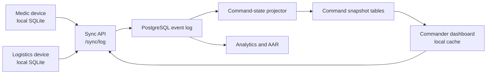

# Architecture

C5 Sentinel-SAR is designed as a local-first command-and-control system for medical SAR workflows. The repo currently contains a prototype and design assets, but the intended architecture is explicit so future implementation work has a stable direction.

## System Shape



## Runtime Boundaries

| Boundary | Responsibility | Current repo artifact |
| --- | --- | --- |
| Field app | Capture patients, vitals, treatments, handovers, and local alerts | `index.html` |
| Command dashboard | Show incident state, stale data, high-risk alerts, and site progress | `index.html`, `assets/mockups/` |
| Domain rules | Triage, vitals timers, tourniquet timers, and alert classification | `src/domain/rules.js` |
| Sync API | Accept and return ordered event batches | `docs/API_SURFACE_v1.2.md` |
| Event store | Preserve clinical and operational history | `database/001_postgresql_schema_v1.2.sql` |
| Projectors | Convert raw events into command-ready state | SQL views and future workers |
| Analytics | Compute KPIs and generate AAR material | `analytics/c5_sentinel_sar_analytics_v1_1/` |

## Event Model

The intended source of truth is an append-only event log.

- Devices create local events first.
- Events receive local IDs and timestamps before sync.
- The server accepts valid events in a batch even if other events fail.
- Invalid or dependency-blocked events are written to an ingestion error table.
- Clinical history is not silently rewritten.
- Command views read projected state.

## Handover and Command State

MIST handover is represented by `PATIENT_HANDED_OVER`. The event is local-first, idempotent by `device_id + local_event_id`, and may carry secure QR token metadata for cross-agency pickup. The projection sets the patient to `handed_over`, clears `needs_full_assessment`, and resolves patient-specific watchdog alerts such as vitals overdue or tourniquet reassessment overdue.

The Chamal/command dashboard should read `incident_command_state` through backend APIs. The database also exposes `vw_command_incident_throughput_funnel` for operational throughput and AAR analytics without forcing dashboard requests to scan the raw event log.

Black/expectant triage is represented by `PATIENT_TRIAGED_EXPECTANT`. It is a fast-exit event: the client bypasses remaining forms, and the projection sets `current_triage = black`, `current_status = deceased`, and `needs_full_assessment = false`.

## Domain Rules

The first extracted domain module is `src/domain/rules.js`. It is deliberately browser-compatible and CommonJS-compatible so the standalone prototype can load it directly while Node can test it without a build step. Because there is no build step, the browser doesn't load this file directly - `index.html` and `demo/rescue-app.html` each carry an inlined copy of the same `buildDomainRules()` factory body. `scripts/check_repo.py` enforces that the inlined copies stay byte-identical (modulo whitespace/formatting) to `src/domain/rules.js`, so a change made in only one place fails CI instead of silently diverging - this is how the SABCDE airway-check drift and the untested `suggestedSweepColor` sweep classifier both happened in the first place.

Covered today:

- vitals reassessment eligibility
- vitals warning/overdue timers
- tourniquet warning/critical timers
- MSTART fast-sweep classification (`suggestedSweepColor` - walking/breathing/perfusion/AVPU/trapped fields, used during the initial scan)
- MSTART full-vitals triage calculation and suggestion reasons (`computeMstartTriage` / `suggestMstartTriage`, used for re-triage once full vitals are recorded - a distinct function from the sweep classifier above, not a duplicate of it)
- deterioration detection
- routine vs. critical alert classification

When changing anything in this file, edit `src/domain/rules.js` first, then copy the exact same `buildDomainRules() { ... }` body into both `index.html` and `demo/rescue-app.html` - `python scripts/check_repo.py` will catch it if the copies drift.

For product-level UI guardrails, see `docs/TACTICAL_UI_GUIDELINES.md`. For the production hardening path, see `docs/PRODUCTION_READINESS.md`.

## Data Freshness

The product treats stale data as an operational condition, not a UI bug.

- Device presence is tracked through heartbeat events.
- Command views must show last-seen and sync-latency indicators.
- Alerts should distinguish "patient deteriorating" from "data stale."
- The AAR should include sync gaps and stale periods.

## Backend Deployment Status

`database/001_postgresql_schema_v1.2.sql` was deployed for the first time this session, to a real Supabase project (`c5-sentinel-sar`, project ref `btvvjmuwdzirjyauyijx`) rather than staying an undeployed draft. Deploying it surfaced real gaps that weren't visible from reading the file - see `database/004_rls_gap_fixes_and_trigger_security_definer.sql` and `database/005_rls_performance_fixes.sql`, applied immediately after: 19 views were bypassing RLS entirely, 17 tables never had RLS enabled, and several trigger functions needed `SECURITY DEFINER` to keep cascading safety-alert writes (e.g. pediatric medication warnings) working once RLS is enforced against real non-service-role accounts. Supabase's security and performance advisors are both clean as of this deployment.

Real Supabase Auth is now wired: one test account per role (including `rpc`/`rcc`, added to the `user_role` enum in `database/006_add_rpc_rcc_enum_values.sql`) exists with a matching `profiles` row, and every RLS boundary described above has been exercised end to end with those accounts, not just asserted - including confirming that a medic's pediatric-medication event genuinely fails to alert without the `SECURITY DEFINER` fix, and that it genuinely works with it. `database/007_rpc_rcc_site_authority_rls.sql` gives `rpc`/`rcc` the site-authority actions from `docs/ROLE_COMMAND_MODEL_v2.8.md` (declare incident official + T0, open/close, building status, site clear, first-responder patient intake) without touching clinical write access.

Not yet done: the `/sync/log` API itself (the client still has zero `fetch()` calls anywhere - this is still a purely local `localStorage` app), and the `rpc`/`rcc` "tactical view scoped to my own platoon/company, no vitals/identity" requirement plus RCC's "limited" resupply visibility - both need a real platoon/company data model (a `platoons` table, `patients.assigned_platoon_id` or equivalent) that doesn't exist anywhere in this schema yet. `platoon` currently only appears as an inventory-ownership tag string (`owner_type = 'platoon_stock'`), never as an actual table or relationship.

## Planned Production Split

The next major implementation should split the repo into these packages only when the prototype behavior is stable enough:

```text
apps/
|-- field-mobile/        # Expo or native mobile app
|-- command-web/         # command dashboard
packages/
|-- domain/              # triage, vitals, alert, inventory rules
|-- fixtures/            # synthetic incidents and patients
services/
|-- sync-api/            # event ingestion and pull API
|-- projectors/          # command state materialization
database/
|-- migrations/
analytics/
|-- c5_sentinel_sar_analytics_v1_1/
```

Until then, favor clarity over premature structure.
