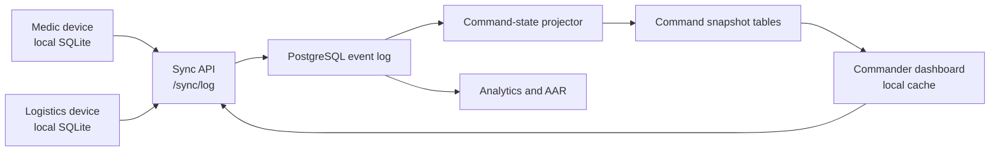

# Architecture

C5 Sentinel-SAR is designed as a local-first command-and-control system for medical SAR workflows. The repo currently contains a prototype and design assets, but the intended architecture is explicit so future implementation work has a stable direction.

## System Shape



## Runtime Boundaries

| Boundary | Responsibility | Current repo artifact |
| --- | --- | --- |
| Field app | Capture patients, vitals, treatments, handovers, and local alerts | `index.html` |
| Command dashboard | Show incident state, stale data, high-risk alerts, and site progress | `index.html`, `assets/mockups/` |
| Domain rules | Triage, vitals timers, tourniquet timers, and alert classification | `src/domain/rules.js` |
| Sync API | Accept and return ordered event batches | `docs/API_SURFACE_v1.1.md` |
| Event store | Preserve clinical and operational history | `database/001_postgresql_schema_v1.1.sql` |
| Projectors | Convert raw events into command-ready state | SQL views and future workers |
| Analytics | Compute KPIs and generate AAR material | `analytics/c5_sentinel_sar_analytics_v1_1/` |

## Event Model

The intended source of truth is an append-only event log.

- Devices create local events first.
- Events receive local IDs and timestamps before sync.
- The server accepts valid events in a batch even if other events fail.
- Invalid or dependency-blocked events are written to an ingestion error table.
- Clinical history is not silently rewritten.
- Command views read projected state.

## Handover and Command State

MIST handover is represented by `PATIENT_HANDED_OVER`. The event is local-first, idempotent by `device_id + local_event_id`, and may carry secure QR token metadata for cross-agency pickup. The projection sets the patient to `handed_over`, clears `needs_full_assessment`, and resolves patient-specific watchdog alerts such as vitals overdue or tourniquet reassessment overdue.

The Chamal/command dashboard should read `incident_command_state` through backend APIs. The database also exposes `vw_command_incident_throughput_funnel` for operational throughput and AAR analytics without forcing dashboard requests to scan the raw event log.

Black/expectant triage is represented by `PATIENT_TRIAGED_EXPECTANT`. It is a fast-exit event: the client bypasses remaining forms, and the projection sets `current_triage = black`, `current_status = deceased`, and `needs_full_assessment = false`.

## Domain Rules

The first extracted domain module is `src/domain/rules.js`. It is deliberately browser-compatible and CommonJS-compatible so the standalone prototype can load it directly while Node can test it without a build step.

Covered today:

- vitals reassessment eligibility
- vitals warning/overdue timers
- tourniquet warning/critical timers
- MSTART triage calculation and suggestion reasons
- deterioration detection
- routine vs. critical alert classification

For product-level UI guardrails, see `docs/TACTICAL_UI_GUIDELINES.md`. For the production hardening path, see `docs/PRODUCTION_READINESS.md`.

## Data Freshness

The product treats stale data as an operational condition, not a UI bug.

- Device presence is tracked through heartbeat events.
- Command views must show last-seen and sync-latency indicators.
- Alerts should distinguish "patient deteriorating" from "data stale."
- The AAR should include sync gaps and stale periods.

## Planned Production Split

The next major implementation should split the repo into these packages only when the prototype behavior is stable enough:

```text
apps/
|-- field-mobile/        # Expo or native mobile app
|-- command-web/         # command dashboard
packages/
|-- domain/              # triage, vitals, alert, inventory rules
|-- fixtures/            # synthetic incidents and patients
services/
|-- sync-api/            # event ingestion and pull API
|-- projectors/          # command state materialization
database/
|-- migrations/
analytics/
|-- c5_sentinel_sar_analytics_v1_1/
```

Until then, favor clarity over premature structure.
